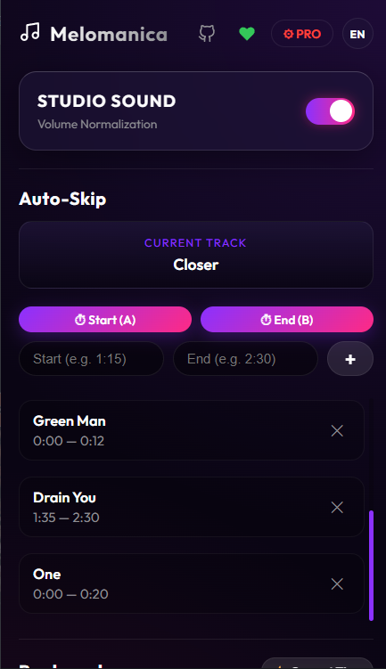
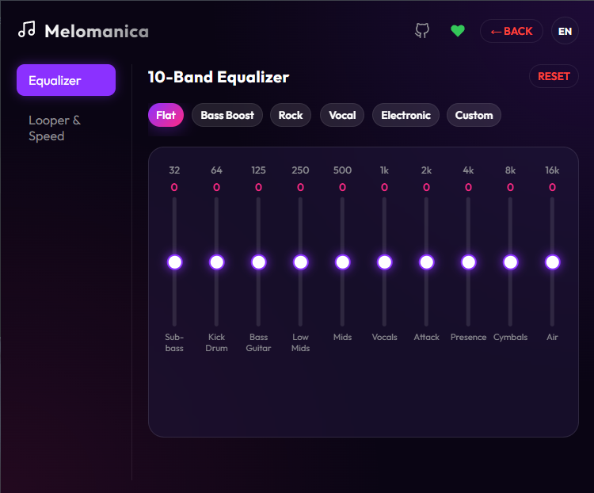

# 🎵 Melomanica

Melomanica is a high-performance browser extension that enhances your YouTube and YouTube Music audio experience. Built with a focus on zero CPU overhead, it provides advanced audio processing and playback controls directly in your browser.

## ✨ Features



*   **Smart Auto-Skip:** Automatically skips boring parts, intros, or specific segments of songs.
*   **A-B Looper:** Precisely loop any specific section of a track with custom playback speed and pitch control.
*   **10-Band Equalizer:** Fine-tune your audio frequencies for the perfect sound.
*   **Studio Sound (Volume Normalization):** Built-in dynamic compressor to balance loud and quiet audio elements.
*   **Track Bookmarks:** Save specific timestamps for your favorite songs and jump to them instantly.

## 🛠 Tech Stack

*   **Frontend:** React, TypeScript
*   **Build Tool:** Vite
*   **Audio Engine:** Web Audio API (BiquadFilterNode, DynamicsCompressorNode)
*   **Extension API:** Manifest V3

## 🚀 Installation for Users

[You can download plugin here](https://chromewebstore.google.com/detail/jocgffimaefemnmjfdjnibimmjemffep?utm_source=item-share-cb)

## 💻 Local Development & Contributing

We welcome contributions! Melomanica is architected for maximum performance and minimal memory footprint.

### Prerequisites
*   Node.js (v18+)
*   npm or yarn

### Setup

1.  Clone the repository:
```bash
    git clone https://github.com/Sany8k/Melomanica.git
```
2.  Install dependencies:
```bash
    npm install
```
3.  Start the development server with Hot Module Replacement (HMR):
```bash
    npm run dev
 ```
4.  Open Chrome and navigate to `chrome://extensions/`.
5.  Enable **Developer mode** in the top right corner.
6.  Click **Load unpacked** and select the `dist` folder generated in the project root.

### Architecture & Performance Guidelines

If you are planning to submit a Pull Request, please adhere to our strict performance standards:

*   **`O(1)` Lookups:** We avoid array iteration (like binary search) for continuous background tasks. Track data and skip intervals are stored in Hash Maps using the YouTube Video ID as the key for instant $O(1)$ access.
*   **No Polling:** Do not use `setInterval` or rely on the `timeupdate` event for calculating jumps. We use pre-calculated native `setTimeout` micro-timers that sleep until the exact millisecond they are needed.
*   **Resource Efficiency:** The current content script consumes `< 1.0ms` of main thread time per minute of playback. Any new features must not block the main thread or cause memory leaks during track switches.

## 💖 Support the Project

If you like Melomanica, consider supporting its development:
*   [Support on Patreon](https://www.patreon.com/posts/support-160332557?utm_medium=clipboard_copy&utm_source=copyLink&utm_campaign=postshare_creator&utm_content=join_link)

## Privacy Policy for Melomanica

Melomanica operates as a fully local browser extension. 

- **Data Collection:** The extension does not collect, store, or transmit any personal data, browsing history, or user information to external servers.
- **Data Storage:** User preferences, equalizer presets, and bookmarks are stored strictly locally on the user's device via `chrome.storage.local`.
- **Third-Party Sharing:** No data is shared with third parties.

## 📄 License

This project is licensed under the MIT License.
